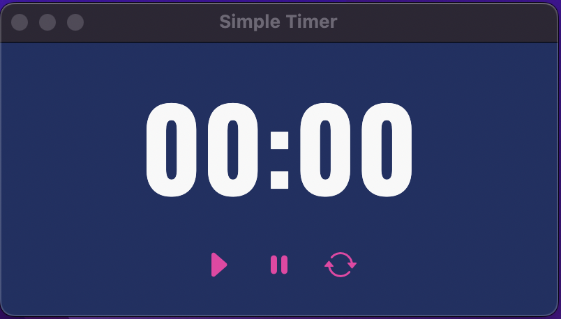

# Simple Timer App

> [!IMPORTANT]\
> 본 프로젝트는 2021.09.17에 만들어진 프로젝트의 백업입니다.

맥OS는 빌트인 타이머가 없는 줄 알고 앱스토어에 들어가보니 타이머 앱은 많은데 전부 유료였다. 그래서 직접 만들어보았다.

## Tech Stack

- Electron
- Svelte
- Rollup
- Sass
- TailwindCSS

## Showcase



## Getting Started

```bash
# Install dependencies
yarn

# Run the app
yarn dev
```

## Project Structure

- [dev-server](./dev-server): Svelte와 Electron의 개발 서버를 관리하는 모듈. Python으로 작성되었으며, `yarn dev` 명령어를 통해 실행된다.
- [src](./src): Timer를 구현하는 모듈. Svelte로 작성되었다.
- [entry](./entry): Electron 애플리케이션을 정의하는 모듈. 
